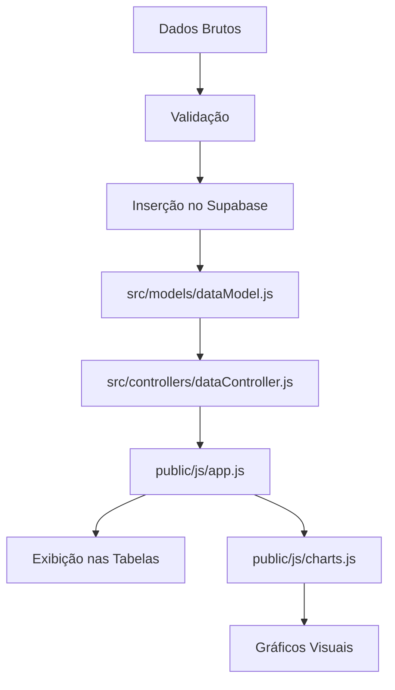

# 📊 Guia Completo de Inserção de Dados - Dashboard ADS

## 🎯 Onde Começar a Inserir Dados (Passo a Passo)

### 📋 1. ESTRUTURA DE DADOS NECESSÁRIA

O sistema espera dados em tabelas no Supabase com a seguinte estrutura:

#### Tabela Principal: `dados_campanhas` (ou similar)
```sql
CREATE TABLE dados_campanhas (
    id SERIAL PRIMARY KEY,
    data DATE NOT NULL,
    empresa VARCHAR(100) NOT NULL,
    gastos DECIMAL(10,2) DEFAULT 0,
    impressoes INTEGER DEFAULT 0,
    cliques INTEGER DEFAULT 0,
    cpc DECIMAL(10,4) DEFAULT 0,
    ctr DECIMAL(5,4) DEFAULT 0,
    custo_prime DECIMAL(10,2) DEFAULT 0,
    total_registros INTEGER DEFAULT 0,
    created_at TIMESTAMP DEFAULT NOW()
);
```

#### Tabela de Usuários: `usuarios`
```sql
CREATE TABLE usuarios (
    id SERIAL PRIMARY KEY,
    email VARCHAR(255) UNIQUE NOT NULL,
    senha VARCHAR(255) NOT NULL,
    role VARCHAR(50) DEFAULT 'User',
    empresa TEXT[], -- Array de empresas que o usuário pode acessar
    ativo BOOLEAN DEFAULT true,
    created_at TIMESTAMP DEFAULT NOW()
);
```

### 🚀 2. PONTOS DE ENTRADA PARA DADOS

#### A) Através da Interface Web (Manual)
**Não implementado ainda** - Seria necessário criar formulários de inserção.

#### B) Através da API (Recomendado)
**Endpoint principal:** `POST /api/data/insert`

#### C) Inserção Direta no Banco (Desenvolvimento/Teste)
```sql
-- Exemplo de inserção manual
INSERT INTO dados_campanhas (data, empresa, gastos, impressoes, cliques, cpc, ctr, custo_prime, total_registros)
VALUES 
('2024-01-15', 'Empresa ABC', 1500.00, 25000, 350, 4.29, 0.0140, 800.00, 45),
('2024-01-15', 'Empresa XYZ', 2200.00, 18000, 420, 5.24, 0.0233, 1200.00, 32);
```

### 📊 3. FLUXO DE DADOS NO SISTEMA



### 🔧 4. ARQUIVOS PRINCIPAIS PARA MODIFICAÇÃO

#### Para Inserção de Dados:
1. **`src/models/dataModel.js`** - Consultas ao banco
2. **`src/controllers/dataController.js`** - Endpoints da API
3. **`src/routes/apiRoutes.js`** - Definição das rotas

#### Para Exibição de Dados:
1. **`public/js/app.js`** - Carregamento e exibição em tabelas
2. **`public/js/charts.js`** - Geração de gráficos
3. **`public/index.html`** - Interface do usuário

### 💾 5. MÉTODOS DE INSERÇÃO RECOMENDADOS

#### Método 1: Script de Importação de Excel/CSV
```javascript
// Exemplo de script para inserir dados de um arquivo Excel
const XLSX = require('xlsx');
const { supabase } = require('./src/config/supabase');

async function importarDadosExcel(caminhoArquivo) {
    const workbook = XLSX.readFile(caminhoArquivo);
    const worksheet = workbook.Sheets[workbook.SheetNames[0]];
    const dados = XLSX.utils.sheet_to_json(worksheet);
    
    for (const linha of dados) {
        await supabase
            .from('dados_campanhas')
            .insert({
                data: linha.data,
                empresa: linha.empresa,
                gastos: parseFloat(linha.gastos),
                impressoes: parseInt(linha.impressoes),
                cliques: parseInt(linha.cliques),
                cpc: parseFloat(linha.cpc),
                ctr: parseFloat(linha.ctr)
            });
    }
}
```

#### Método 2: API Endpoint para Inserção
```javascript
// Em src/controllers/dataController.js
static async inserirDados(req, res) {
    try {
        const { data, empresa, gastos, impressoes, cliques } = req.body;
        
        const resultado = await DataModel.inserirMetricas({
            data,
            empresa,
            gastos,
            impressoes,
            cliques,
            cpc: gastos / cliques,
            ctr: (cliques / impressoes) * 100
        });
        
        res.json({ sucesso: true, dados: resultado });
    } catch (erro) {
        res.status(500).json({ erro: erro.message });
    }
}
```

### 🎛️ 6. CONFIGURAÇÃO INICIAL NECESSÁRIA

#### A) Configurar Supabase
1. Criar projeto no Supabase
2. Configurar variáveis em `src/config/supabase.js`
3. Criar tabelas necessárias

#### B) Configurar Usuários
```sql
-- Inserir usuário administrador inicial
INSERT INTO usuarios (email, senha, role, empresa)
VALUES ('admin@exemplo.com', '$2b$10$hash_da_senha', 'Admin', ARRAY['Todas']);
```

#### C) Dados de Teste
```sql
-- Inserir dados de exemplo para teste
INSERT INTO dados_campanhas (data, empresa, gastos, impressoes, cliques, cpc, ctr, custo_prime, total_registros)
VALUES 
('2024-01-01', 'Empresa Teste', 1000.00, 10000, 100, 10.00, 0.01, 500.00, 25),
('2024-01-02', 'Empresa Teste', 1200.00, 12000, 120, 10.00, 0.01, 600.00, 30);
```

### 🔄 7. AUTOMAÇÃO DE INSERÇÃO DE DADOS

#### Script Diário (Cron Job)
```bash
# Executar todo dia às 6h da manhã
0 6 * * * cd /caminho/para/projeto && node scripts/importar-dados-diarios.js
```

#### Webhook para Dados em Tempo Real
```javascript
// Endpoint para receber dados de ferramentas externas
app.post('/webhook/dados-campanha', async (req, res) => {
    try {
        const dados = req.body;
        await DataModel.inserirMetricas(dados);
        res.json({ sucesso: true });
    } catch (erro) {
        res.status(500).json({ erro: erro.message });
    }
});
```

### 📈 8. VALIDAÇÃO DE DADOS

#### Campos Obrigatórios:
- ✅ `data` - Data da campanha (formato YYYY-MM-DD)
- ✅ `empresa` - Nome da empresa
- ✅ `gastos` - Valor gasto (decimal)

#### Campos Calculados Automaticamente:
- 🔢 `cpc` = gastos ÷ cliques
- 🔢 `ctr` = (cliques ÷ impressões) × 100
- 🔢 `cpl_meta` = gastos ÷ total_registros
- 🔢 `cpl_total` = (custo_prime + gastos) ÷ total_registros

### 🚨 9. PROBLEMAS COMUNS E SOLUÇÕES

#### Erro: "Dados não aparecem na interface"
- ✅ Verificar se a data está no formato correto
- ✅ Confirmar que o usuário tem acesso à empresa
- ✅ Verificar logs do console do navegador

#### Erro: "Falha na conexão com Supabase"
- ✅ Verificar credenciais em `src/config/supabase.js`
- ✅ Confirmar que o projeto Supabase está ativo
- ✅ Testar conexão com `node test-supabase.js`

### 📝 10. CHECKLIST PARA INSERÇÃO DE DADOS

```
□ 1. Configurar Supabase e criar tabelas
□ 2. Inserir usuários no sistema
□ 3. Testar conexão com o banco
□ 4. Preparar dados no formato correto
□ 5. Escolher método de inserção (manual/API/script)
□ 6. Executar inserção de dados
□ 7. Verificar na interface web
□ 8. Configurar automação (se necessário)
```

### 🔗 PRÓXIMOS PASSOS

1. **Configurar tabelas no Supabase**
2. **Criar script de importação de dados**
3. **Testar inserção manual**
4. **Implementar validações**
5. **Configurar automação**

---

💡 **Dica:** Comece sempre com dados de teste pequenos para validar o fluxo antes de inserir grandes volumes de dados!
